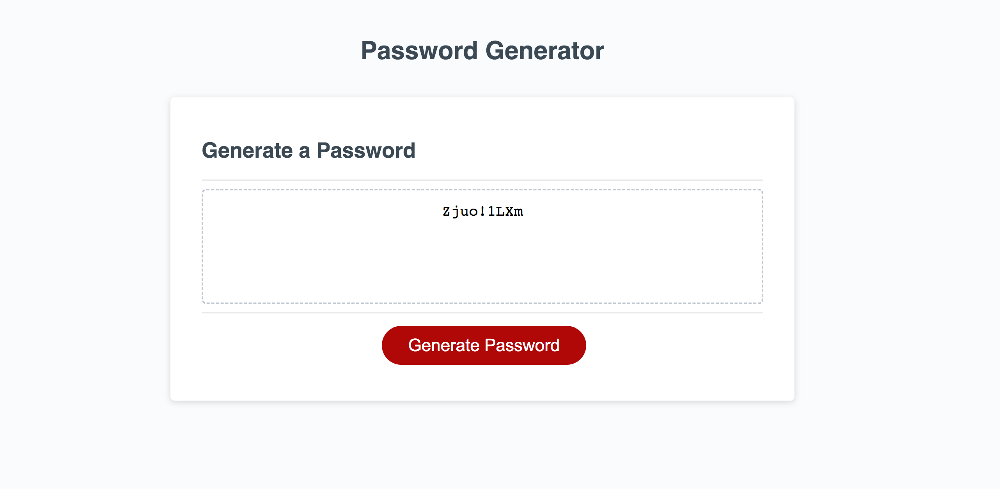
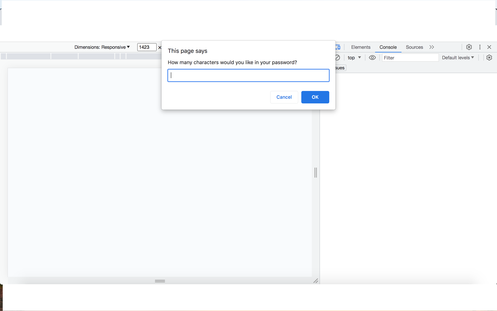

# Password-Generator

# Description
This password generator project uses HTML and CSS stater code to design to look of the webpage and uses JavaScript code that has been adapted to enable the functionality of the password generator. The aim of this project is to enable prompts and confirms for the user to identify the desired length and characteristics of their random password. Then the password genertor will randomly select strings from the arrays to display a new password in the password box on the webpage. Functions are used throughout, along with if statements and a for loop to enable this project to work.  

# Installation
N/A

# Usage
To use this webpage to create a random password, the  red generate password button needs to be clicked. After that a prompt box will appear asking the user how long the passwrod should be. if it is less than 8 or more than 128 an alert will appear telling the user that the length needs to be within that range. Then four confirm statements will appear one after the other asking if the user wants lower case, upper case, numeric or special characters in their password. If nonw are chosen an alert will appear telling the user to pick at least one. Finally, a random password will be displayed in the password box which matches the request of the user.

To access the webpage click this link: https://embow24.github.io/Password-Generator/ 

Below is a screenshot of the webpage displaying the prompt and of the random password generated:

# Credits
This forum was used to support the understanding of how to make the password generate a random answer: https://codeforum.org/threads/javascript-password-generator-i-need-help.6275/

A tutoring session with Juan Delgado was used to help understand that the function wasn't working because it wasn't being called.

# License
MIT